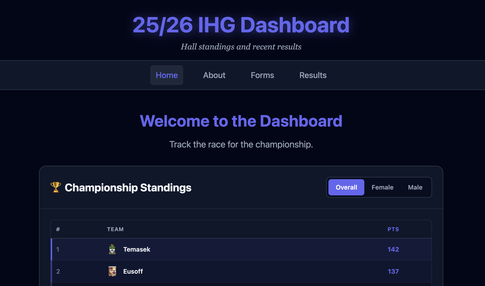
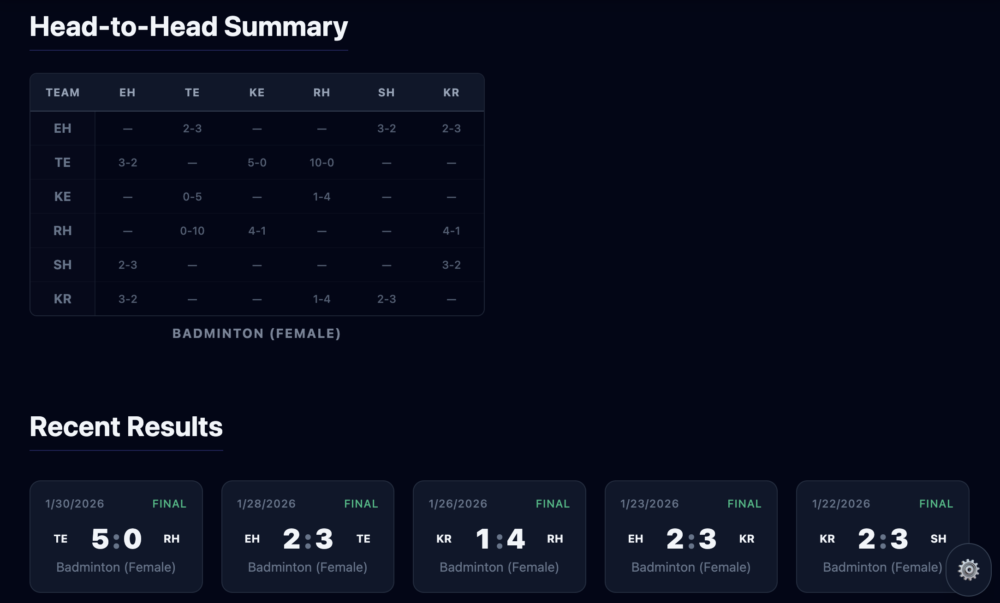
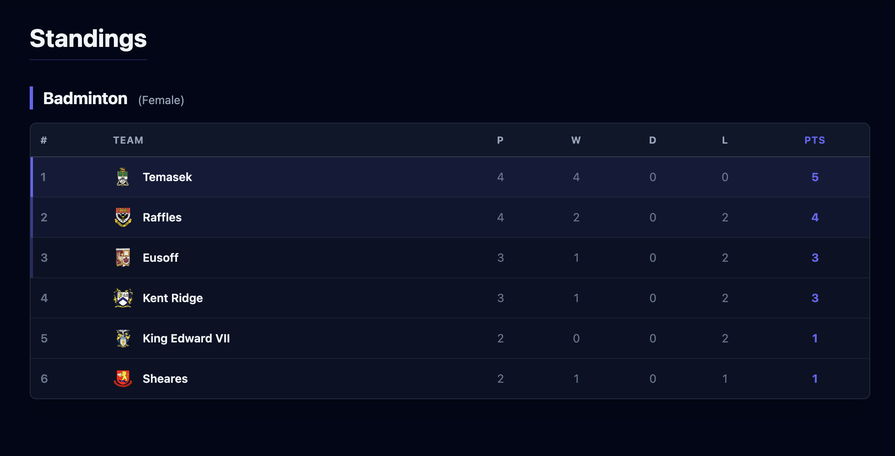
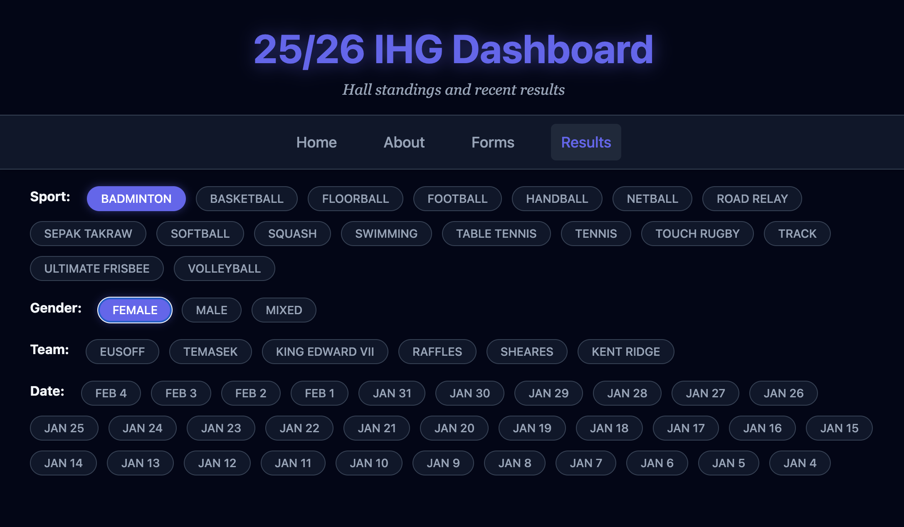
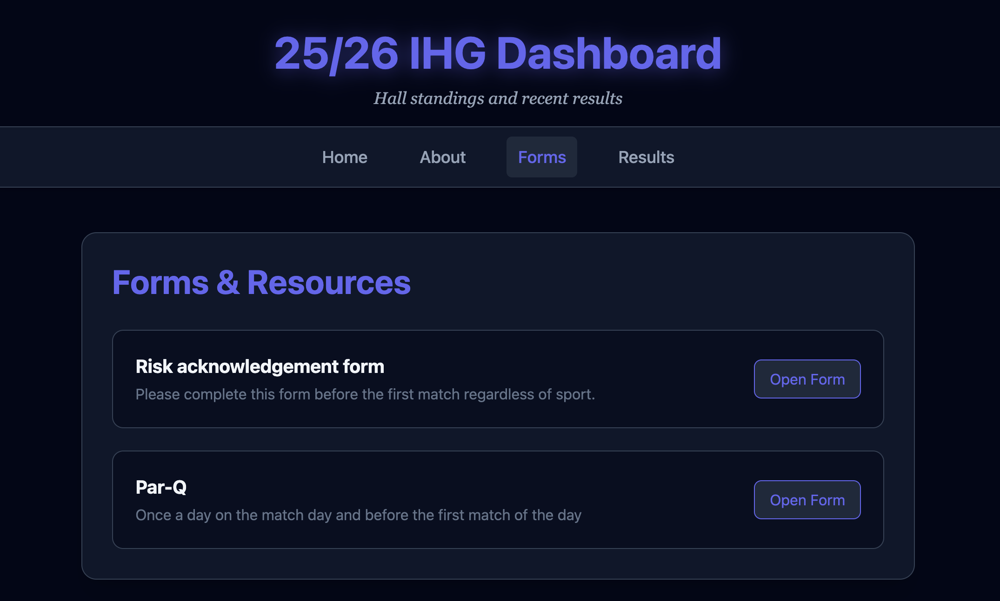

# IHG 25/26 Score Dashboard

Track your league's performance with a clean, fast, and responsive sports dashboard.

**Live Demo:** [https://ihg2526.github.io/dashboard/](https://ihg2526.github.io/dashboard/)

## 📸 Features

- 🏆 **League Standings** - View current team rankings with points and goal difference
- ⚽ **Match Results** - Check recent and upcoming match results
- 🆚 **Head-to-Head Comparison** - Compare team statistics side by side
- 📱 **Responsive Design** - Works seamlessly on mobile, tablet, and desktop
- 📝 **Forms Management** - Upload and manage team forms with file upload support
- 🔧 **Admin Panel** - Full control over teams, matches, and standings (development mode)
- 🐳 **Dockerized Full Stack** - Containerized setup with Nginx reverse proxy
- 🔙 **Backend API** - Robust Node.js/Express backend for data management

## 🖼️ Screenshots

**Home**

**Results**

**Standings**

**Filters**

**Forms**

## 🔍 Search Keywords

**nus ihg2526 dashboard**
